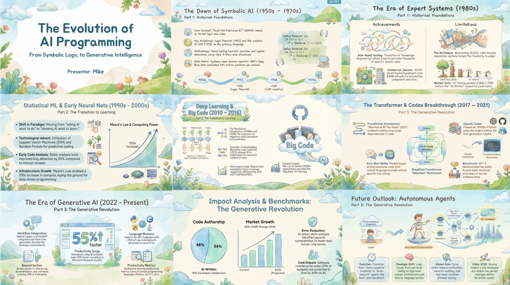
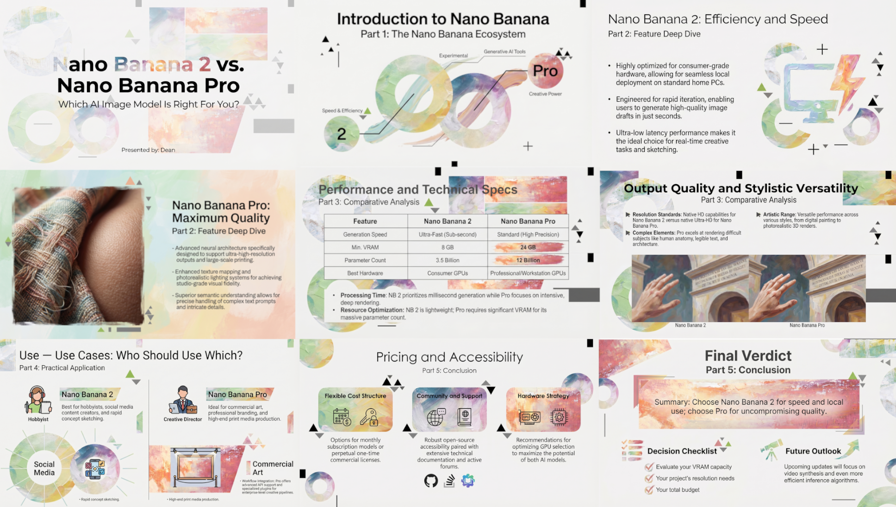
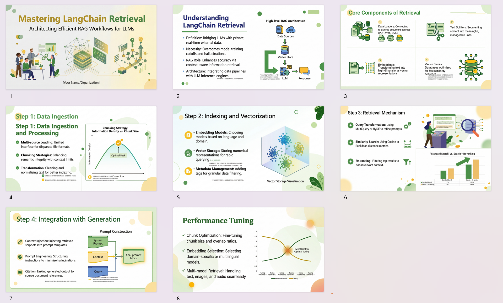
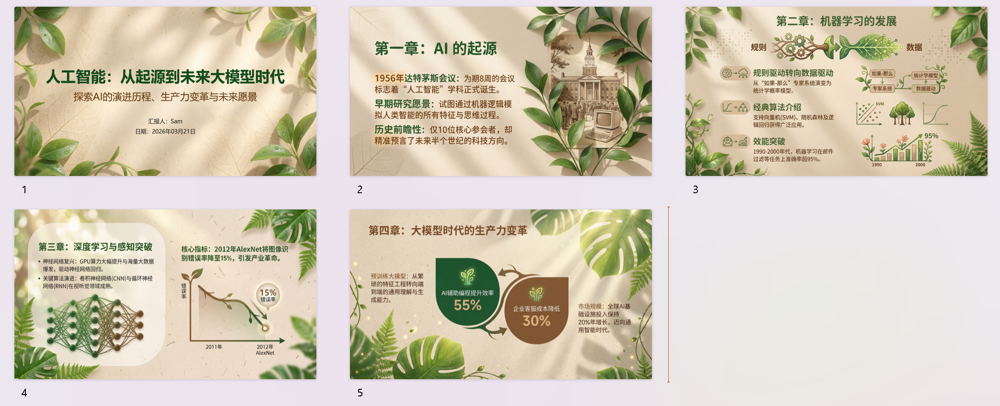

 

<b>A native AI Slide generation app built on Nano Banana Pro🍌 </b>

<b>Start from an idea to generate outlines and page descriptions, then refine content, layout, and style. Support for reference files, asset reuse, and template reuse makes the entire presentation workflow easier and more controllable.</b>

  <a href="https://ppt.gptbox.net"><b>🚀 Live Demo</b></a>
  &nbsp;•&nbsp;
  <a href="README_EN.md"><b>English</b></a>

  If this project is helpful to you, feel free to <b>Star 🌟</b> & <b>Fork 🍴</b>

## ✨🤖 Project Origin

Have you ever found yourself in this situation: a presentation due tomorrow, but the slides are still blank; countless great ideas in your head, yet the tedious layout and design work drains all your enthusiasm?

We wanted to create presentations that are both professional and visually appealing in a short amount of time. Traditional AI Slide generation tools satisfy the need for “speed,” but still have the following shortcomings:

- 1️⃣ Only preset templates are available, making it difficult to adjust styles flexibly  
- 2️⃣ Low freedom, making multi‑round revisions hard to accomplish  
- 3️⃣ Outputs look similar, leading to serious homogenization  
- 4️⃣ Low‑quality assets that lack relevance to the content  
- 5️⃣ Disconnected text‑image layouts, resulting in poor design coherence  

These issues make it hard for traditional tools to achieve both “efficiency” and “aesthetics.” Even though some products call themselves “Vibe Slide,” in practice they still fall short of a true “Vibe.”

🧠 Then came the **Nano Banana Pro 🍌 model**, which opened up new possibilities. We experimented with generating slide pages using Banana Pro and found that the results were excellent in terms of quality, visual appeal, and style consistency. It can almost precisely render all the text specified in the prompt while strictly following the style of the reference image. So why not build a native AI application around Nano Banana Pro?

---

## 👨‍💻⚡ Use Cases

1. **Beginners**: zero‑threshold generation of beautiful PPTs without design experience, eliminating the hassle of choosing templates  
2. **Slide Professionals**: quickly gather design inspiration from AI‑generated layouts and text‑image compositions  
3. **Educators**: efficiently convert teaching materials into illustrated lesson plans, improving classroom presentation  
4. **Students**: rapidly complete assignments and presentations, focusing on content rather than formatting and beautification  
5. **Business Users**: fast visualization of business proposals, product introductions, etc., with easy adaptation to multiple scenarios  

> 🎯 **Goal: lower the barrier to slides creation, enabling everyone to effortlessly produce beautiful, professional presentations**

## 🎨 Example Results
Refer to the cases in the `case` folder.

## 🎯 Features

### 1. Flexible Creation Paths
Support three starting modes: **Idea**, **Outline**, and **Page Description**, catering to different creative habits.
- **One‑sentence generation**: input a topic, and the AI automatically generates a well‑structured outline and detailed page descriptions.
- **Natural language editing**: modify the outline or description verbally (e.g., “change the third page to a case study”), and the AI responds in real time.
- **Outline / Description mode**: batch generation with one click, or manual fine‑tuning.

### 2. Powerful Content Parsing
- **Multi‑format support**: upload PDF/Docx/MD/Txt files, and the backend automatically parses the content.
- **Intelligent extraction**: automatically identifies key points, image links, and chart information from the text, enriching the generation process.
- **Style reference**: upload reference images or templates to customize the PPT style.

### 3. “Vibe”‑Style Natural Language Modification
No longer constrained by complex menus – just give modification instructions in **natural language**.
- **Local redraw**: verbally modify unsatisfactory areas (e.g., “change this chart to a pie chart”).
- **Full‑page optimization**: generate high‑definition, style‑consistent pages powered by Nano Banana Pro🍌.

### 4. Ready‑to‑Use Export Formats
- **Multi‑format export**: export standard **PPTX** or **PDF** with one click.
- **Perfect compatibility**: default 16:9 aspect ratio, no additional layout adjustments needed – ready for presentation.

### 5. Editable PPTX Export (Beta)
- **Export images with high fidelity, clean backgrounds, and freely editable images and text.**

 

**🌟Comparison with notebooklm slide deck functionality**
| Feature | notebooklm | This Project | 
| --- | --- | --- |
| Page Limit | 15 pages | **Unlimited** | 
| Secondary Editing | Not supported | **Selection editing + verbal editing** |
| Adding Assets | Not possible after generation | **Freely add after generation** |
| Export Formats | PDF only | **PDF, (editable) PPTX** |
| Watermark | Free version has watermark | **No watermark, freely add/remove elements** |

> Note: As new features are added, this comparison may become outdated.

## 🗺️ Roadmap

| Status | Milestone |
| --- | --- |
| ✅ Completed | Create PPT from idea, outline, or page description; polish PPT |
| ✅ Completed | Parse Markdown images from text |
| ✅ Completed | Add more assets to a single PPT page |
| ✅ Completed | Box‑select area on a PPT page for “Vibe” verbal editing |
| ✅ Completed | Asset module: generate assets, upload, etc. |
| ✅ Completed | Upload and parse multiple file types |
| ✅ Completed | Verbally adjust outline and descriptions |
| ✅ Completed | Initial support for editable PPTX export |
| 🔄 In Progress | Support for multi‑layered, precise cut‑out editable PPTX export |
| 🔄 In Progress | Web search |
| 🔄 In Progress | Agent mode |
| 🚍 Partially Done | Optimize frontend loading speed |
| 🧭 Planned | Online presentation mode |
| 🧭 Planned | Simple animations and page transitions |
| 🚍 Partially Done | Multi‑language support |
| 🏢 Commercial Features | User and billing system |

#### Requirements
- Python 3.10 or higher
- [uv](https://github.com/astral-sh/uv) – Python package manager
- Node.js 16+ and npm
- A valid Google Gemini API key
- (Optional) [LibreOffice](https://www.libreoffice.org/) – required when using the “Refresh PPT” feature to upload PPTX files, used to convert PPTX to PDF. **It is recommended to convert PPTX to PDF locally before uploading** because LibreOffice rendering on the server may cause layout issues due to missing fonts (e.g., Microsoft YaHei, Calibri) and cannot fully restore some special effects. Uploading PDF files does not require LibreOffice. Docker users who still need PPTX upload support inside the container can run:
  > Note: LibreOffice installed this way will be lost after the container is rebuilt and must be reinstalled.

## 🛠️ Tech Stack

### Frontend
- **Framework**: React 18 + TypeScript
- **Build Tool**: Vite 5
- **State Management**: Zustand
- **Routing**: React Router v6
- **UI Components**: Tailwind CSS
- **Drag & Drop**: @dnd‑kit
- **Icons**: Lucide React
- **HTTP Client**: Axios

### Backend
- **Language**: Python 3.10+
- **Framework**: Flask 3.0
- **Package Manager**: uv
- **Database**: SQLite + Flask‑SQLAlchemy
- **AI Capabilities**: Google Gemini API
- **PPT Processing**: python‑pptx
- **Image Processing**: Pillow
- **Concurrency**: ThreadPoolExecutor
- **CORS**: Flask‑CORS

## Community
Join our QQ group for communication and support.

Feel free to suggest new features or report issues – I will respond!

Welcome to join the QQ group for questions and inquiries.

## **🔧 FAQ**

1. **Text appears garbled or unclear on generated pages**
   - Choose a higher resolution output (OpenAI format may not support resolution adjustment; using the Gemini format is recommended). Tests show that increasing the resolution from 1K to 2K before generation significantly improves text rendering quality.
   - Ensure that the page description includes the specific text to be rendered.

2. **Editable PPT export quality is poor (text overlapping, missing styles, etc.)**
   - This feature is under continuous improvement.

3. **Does it support a free‑tier Gemini API key?**
   - The free tier only supports text generation, not image generation.

4. **503 error or Retry Error during generation**
   - Feel free to join the community group for help.
